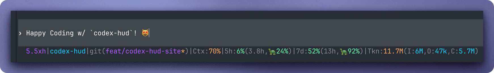

**Language** · English | [Português (Brasil)](README.pt-BR.md) | [简体中文](README.zh-CN.md) | [繁體中文](README.zh-TW.md) | [日本語](README.ja.md) | [한국어](README.ko.md) | [Türkçe](README.tr.md) | [Русский](README.ru.md) | [Tiếng Việt](README.vi.md) | [ไทย](README.th.md) | [Deutsch](README.de.md) | [Español](README.es.md)

<div align="center">

# Codex HUD

**A workspace HUD for the OpenAI Codex CLI — compact single-line footer status for patched mode, plus standalone workspace snapshots for local inspection.**

[](https://github.com/brandonwie/codex-hud/blob/main/package.json)
[](LICENSE)
[](https://github.com/brandonwie/codex-hud/stargazers)
[](https://github.com/brandonwie/codex-hud/commits/main)

[](https://nodejs.org)
[](https://github.com/openai/codex)
[](#configuration)
[](#quick-start)

<a href="https://brandonwie.github.io/codex-hud/">Website</a> · <a href="https://brandonwie.github.io/codex-hud/#try">Try settings</a>



[Features](#features) · [Quick Start](#quick-start) · [Configuration](#configuration) · [Patched Codex Footer](#experimental-patched-codex-footer) · [Roadmap](#roadmap)

</div>

---

Codex HUD is a local Codex plugin with two surfaces: standalone commands can print an expanded workspace snapshot for local inspection, and the experimental patched Codex TUI can render the compact `--line` output as a single-line footer.

By default it is a companion to Codex's native `[tui].status_line`, because stock Codex cannot render arbitrary plugin output under the input area — it exposes a configurable built-in status item array but not a plugin-owned renderer. This repo also ships a maintained patch path for users who want the compact status line to render directly in the real Codex footer.

The compact status line, printed by `--line` (rendered as an in-TUI footer only in patched mode):

```text
5.5xhigh|codex-hud|git(main*)|Ctx:21%|5h:17%(5h,🐢100%)|7d:16%(5.1d,👾27%)|Tkn:904k(I:533k,O:5k,C:366k)
```

> The segments, labels, colors, and thresholds in that line are all configurable — see [Configuration](#configuration).

The default status-line renderer is `codex-hud-rs`, this repo's small Rust binary; the Node script (`plugins/codex-hud/scripts/codex-hud.js`) stays as the documented fallback and parity oracle. Two different "Rust"s appear in this README: the upstream Codex CLI is itself a Rust program (the build target of the experimental patch below), while `codex-hud-rs` is the in-repo status-line renderer.

## Features

- Codex version, model, reasoning effort, sandbox, and approval mode
- Native Codex status-line item count and color setting
- Compact usage parsed from Codex rollout logs — the compact line above (an in-TUI footer in patched mode)
- Current working directory, git branch, dirty counts, and repo root
- Project hints such as package name, nearby `AGENTS.md`, and 3B `ACTIVE-STATUS.md` priority when present
- Codex hook event counts from `hooks.json`
- A clear note that Codex's native status line remains authoritative for live token and rate-limit values

## Quick Start

Clone the repo, then install it as a local Codex plugin:

```bash
git clone https://github.com/brandonwie/codex-hud.git
cd codex-hud

# Register this repo as a local plugin marketplace, then add the plugin:
codex plugin marketplace add "$(pwd)"
codex plugin add codex-hud@codex-hud
```

Start a new Codex thread after installing or reinstalling so the skill list is refreshed.

> **Tip:** `codex plugin marketplace add "$(pwd)"` reads the current directory, so run it from the repo root. You can also pass an explicit path instead of `"$(pwd)"`.

Then install the HUD launcher (recommended). The default mode **delegates to your real Codex install**, so Homebrew/npm Codex updates are picked up automatically — no rebuilds, no patched binaries. To be clear: the stock-delegation launcher does **not** render an in-TUI footer — it provides safe delegation plus the managed `codex` shim; an in-TUI footer exists only in the experimental patched mode below.

```bash
npm run install:launcher                    # installs ~/.local/bin/codex-hud-tui
npm run install:launcher -- --make-default  # optional: make `codex` resolve to the launcher
rehash
```

Optionally, build the Rust status-line renderer. This changes nothing visible in a stock-launched TUI — it matters for the experimental patched footer and for standalone `codex-hud-rs` use (`--watch`, or hand-wiring `status_line_command` into other tools). Once built, the installer picks it up automatically (`--renderer auto`) for patched mode and `--print-config`:

```bash
npm run build:rust   # optional: builds rust/target/release/codex-hud-rs
```

See [HUD Launcher](#hud-launcher-stock-delegation--default) for details and `npm run doctor` for diagnostics.

## Usage

Run the Node renderer directly during development:

```bash
node plugins/codex-hud/scripts/codex-hud.js           # standalone expanded snapshot
node plugins/codex-hud/scripts/codex-hud.js --line     # single compact line
node plugins/codex-hud/scripts/codex-hud.js --line --color
node plugins/codex-hud/scripts/codex-hud.js --json      # machine-readable
node plugins/codex-hud/scripts/codex-hud.js --watch 5   # refresh every 5s
npm test
```

Terminal capture of the compact status line (`--line`):

```text
$ node plugins/codex-hud/scripts/codex-hud.js --line
5.5xhigh|codex-hud|git(main)|Ctx:50%|5h:4%(4.0h,🐢21%)|7d:20%(4.9d,👾30%)|Tkn:5.6M(I:2.9M,O:20k,C:2.7M)
```

Run `node plugins/codex-hud/scripts/codex-hud.js --line --color` locally to see the same line with ANSI color styling.

`codex-hud-rs` (after `npm run build:rust`) exposes the identical flag surface — `--line` / `--status-line` / `--color` / `--json` / `--watch` / `--init-config` / `--print-config` / `--config-path`:

```bash
./rust/target/release/codex-hud-rs --line --color
```

## Configuration

Both the standalone workspace snapshot and the compact status line are configurable through an optional `codex-hud.toml`; the Node and Rust renderers read the same `codex-hud.toml` tiers. With no config file you get the defaults shown above; every key is optional and anything you omit inherits the built-in default.

The canonical schema lives in [`spec/config-schema.md`](spec/config-schema.md). This README shows the common options; use the schema when changing parser behavior or validating every supported field.

```bash
codex-hud --init-config     # scaffold ~/.codex/codex-hud.toml (--force to overwrite)
codex-hud --print-config    # print the resolved, merged config as JSON
codex-hud --config-path     # show which config files are in effect
```

### Search order

Later sources override earlier ones (per key — arrays replace, scalars override):

1. built-in defaults
2. `$CODEX_HOME/codex-hud.toml` (per-user; `$CODEX_HOME` defaults to `~/.codex`)
3. `./.codex/codex-hud.toml` (per-project; walks up to the git root)
4. `$CODEX_HUD_CONFIG` (explicit file path via env var)

A missing file is fine. A malformed or invalid file is ignored — the HUD falls back to defaults and prints a one-line note on stderr, so the status line never breaks. codex-hud keeps its own file instead of a table inside Codex's `config.toml`, so a bad HUD config can never stop Codex from launching.

### Options

```toml
# Compact by default. Set true for " | " segment spacing and ": " labels.
space = false

# Text placed between segments. The space flag controls padding around this text.
separator = "|"

# Which segments to show, in order. Ids:
#   model, project, branch, runtime, ctx, 5h, 7d, tkn
# Aliases: workspace = project + branch + runtime; context = ctx; tokens = tkn.
# (runtime / "node vX" is available but off by default — add it to opt in.)
segments = ["model", "project", "branch", "ctx", "5h", "7d", "tkn"]

# Rename a segment's label (keys are segment ids).
[labels]
ctx = "Ctx"

# Colors: a palette name, a 256-color code (0-255), or "#rrggbb" (mapped to the
# nearest 256 color). Names: dim, coral, mint, amber, cyan, violet, neonViolet.
# ok / warn / crit are the threshold colors shared by ctx / 5h / 7d.
[colors]
model = "neonViolet"
branch = "#5fafff"
ok = "mint"
warn = "amber"
crit = "coral"

# Percent thresholds (0-100) that switch ctx/5h/7d between ok/warn/crit.
[thresholds.percent]
warn = 70
crit = 90

# Formatting toggles.
[format]
percentRound = true # false -> one decimal place
tokenUnits = true   # false -> raw integers (no k/M)
tokenUsage = true   # false -> total only, hide (I:.. O:.. C:..)
pace = true         # false -> hide the pace % in 5h/7d
modelShort = true # false -> gpt-5.5 instead of 5.5
effortShort = false # true -> xh instead of xhigh
paceSlowPrefix = "🐢"
paceNormalPrefix = "👾"
paceFastPrefix = "🔥"
```

Pace markers compare usage against even burn rate: slow is more than `thresholds.pace.crit` behind pace, fast is more than `thresholds.pace.crit` ahead, and the middle band is normal. Run `codex-hud --print-config` to see the full resolved option set.

## Platform Support

The supported launcher flow targets macOS and Linux shells. WSL can work when paths resolve through the Linux filesystem, but native Windows shells are not supported because the managed launchers are Bash scripts.

## HUD Launcher (Stock Delegation — Default)

`npm run install:launcher` writes `~/.local/bin/codex-hud-tui`, a small launcher that finds your real (stock) Codex install and executes it with `exec -a codex`, so terminal integrations such as Herdr still recognize the pane as a Codex session. The stock binary's path is baked in at install time, with a runtime fallback that re-discovers Codex on `PATH` (skipping all HUD-managed entries, so the launcher can never recurse into itself).

Because the launcher delegates to stock Codex:

- Homebrew/npm Codex updates are picked up automatically — no rebuilds.
- Your Homebrew/stock Codex files are never modified or replaced.
- `npm run install:launcher -- --make-default` installs the managed `~/.local/bin/codex` shim; the installer refuses to replace a non-managed `codex` unless you pass `--force-shim`.

Remove only the managed shim with:

```bash
node scripts/install-patched-codex.js --uninstall-shim
rehash
which codex
```

### Doctor

`npm run doctor` prints the full launch-chain state — shim, launcher mode (stock/patched/legacy), stock Codex path + version, renderer state, patched payload versions, staleness, and leftover artifacts:

```text
prefix: /Users/you/.local/bin
codex shim: managed -> /Users/you/.local/bin/codex-hud-tui (/Users/you/.local/bin/codex)
launcher: v2 mode=stock (/Users/you/.local/bin/codex-hud-tui)
launcher metadata: stock_path=/opt/homebrew/bin/codex stock_realpath=/opt/homebrew/Cellar/codex/0.139.0/bin/codex stock_version=0.139.0 renderer=rust built_at=2026-06-10T12:00:00.000Z
stock codex: /opt/homebrew/bin/codex (0.139.0, realpath /opt/homebrew/Cellar/codex/0.139.0/bin/codex)
renderer: rust (/Users/you/.local/bin/codex-hud-rs, v0.2.0; used by --print-config/patched mode only — stock launcher does not invoke it)
patched payload dir: /Users/you/.local/bin/codex-hud-codex.d
patched versions: (none)
patched command: (none)
status: healthy
```

It exits non-zero only when the active entrypoint chain is broken — renderer degradation never flips a healthy status. The renderer rebuild recommendation is release-granularity: it compares the compile-time `codex-hud-rs` version against `package.json`, so it fires when a release moves the version, not on every commit.

## Troubleshooting

Start with `npm run doctor`; it prints the active shim, launcher, stock Codex, renderer, and patched payload state.

| Symptom | Doctor signal | Fix |
| ------- | ------------- | --- |
| `codex` does not start after enabling the shim | `codex shim` missing, unmanaged, or points somewhere unexpected | Run `npm run install:launcher -- --make-default`, then `rehash`. If a non-managed shim exists, inspect it before using `--force-shim`. |
| Exit 127 or "no stock codex found" | `stock codex: not found` or launcher metadata has no usable stock path | Install or repair the stock Codex CLI, then rerun `npm run install:launcher` so the launcher records the real path. |
| Patched footer disappeared after a Codex update | `patched command` exists but doctor reports stale versions | Rerun `npm run patch:codex`, or switch back to stock delegation with `npm run install:launcher`. |
| Config changes are ignored | `codex-hud --config-path` does not list the file you edited, or `--print-config` shows defaults | Move the config to `$CODEX_HOME/codex-hud.toml`, `./.codex/codex-hud.toml`, or set `$CODEX_HUD_CONFIG` to the exact file. |
| Rust renderer is not used | `renderer` reports Node fallback, missing binary, or failed health check | Run `npm run build:rust`, then reinstall the launcher or rerun the patched flow that should use the Rust renderer. |

### Migrating from an older codex-hud install

If you previously ran `npm run patch:codex` (the old default flow), run `npm run install:launcher` once: it rewrites `codex-hud-tui` to stock delegation and keeps your existing `codex` shim working. A healthy legacy `codex-hud-codex` command is left in place (with a staleness note); a broken one is quarantined as `codex-hud-codex.broken-<timestamp>` so it fails fast instead of dying mid-launch. The next `npm run patch:codex` migrates a legacy flat payload into the versioned layout automatically. `npm run doctor` shows anything left over.

## Experimental: Patched Codex Footer

> **Warning — experimental.** This mode builds a locally patched, unsigned Codex binary. macOS may kill unsigned rebuilds (the installer health-checks every payload *before* activating it, so a failed build can never break your active `codex`), and the patched binary **goes stale when stock Codex updates** — you must rerun `npm run patch:codex` after Codex updates. Prefer the default stock-delegating launcher unless you specifically want the in-TUI footer.

Stock Codex cannot render arbitrary plugin output under the input area. To get a Claude-HUD-style footer, build a separate patched Codex command:

```bash
npm run patch:codex:dry-run
npm run patch:codex
```

The installer patches the matching OpenAI Codex tag, builds the Rust CLI, and stages the executable under `~/.local/bin/codex-hud-codex.d/<version>/codex`. The staged payload must pass a `--version` health check **before** anything is activated; only then is `~/.local/bin/codex-hud-codex` atomically retargeted to the new payload, and the previous version is kept on disk for rollback. A failed build is kept aside as `<version>.failed` and the active runtime is left untouched. It also writes `~/.local/bin/codex-hud-tui` in patched mode, a launcher that passes the colored status-line command through Codex's `-c tui.status_line_command=...` override without changing `~/.codex/config.toml`. With the default `--renderer auto`, the injected command is `'~/.local/bin/codex-hud-rs' --line --color` when the Rust renderer is installed, falling back to `node .../plugins/codex-hud/scripts/codex-hud.js --line --color` otherwise. The executable path and `argv[0]` both keep Codex-visible names, so terminal integrations such as Herdr can still recognize the pane as a Codex session.

Safe launcher mode leaves your normal `codex` command alone:

```bash
codex-hud-tui
```

To make a fresh `codex` launch use the HUD-enabled TUI, opt in to the managed shim:

```bash
npm run patch:codex -- --make-default
rehash
which codex
codex
```

`which codex` should resolve to `~/.local/bin/codex`. The installer refuses to replace an existing `~/.local/bin/codex` unless you pass `--force-shim`, and it still refuses to install the patched binary itself as `codex` unless you pass `--replace-codex`.

Rollback removes only the managed `codex` shim:

```bash
node scripts/install-patched-codex.js --uninstall-shim
rehash
which codex
```

If you prefer a persistent config, add the printed line under your existing `[tui]` table, but note that stock Codex versions may reject unknown fields. Generate the exact line for your machine from the repo root (`node scripts/install-patched-codex.js --print-config` resolves the renderer the same way the installer does):

```bash
echo "status_line_command = \"$HOME/.local/bin/codex-hud-rs --line --color\""
# Node fallback (no Rust build):
echo "status_line_command = \"node $(pwd)/plugins/codex-hud/scripts/codex-hud.js --line --color\""
```

Then paste it under `[tui]` in `~/.codex/config.toml`:

```toml
# Replace /Users/you with your home directory.
status_line_command = "/Users/you/.local/bin/codex-hud-rs --line --color"
# Node fallback — replace /path/to/codex-hud with your local clone path:
# status_line_command = "node /path/to/codex-hud/plugins/codex-hud/scripts/codex-hud.js --line --color"
```

Run `codex-hud-tui` to see the compact footer. The patched binary does not track stock Codex updates: when stock Codex changes after a build, the patched launcher prints a one-line warning at launch (it still runs the patched binary you opted into) — rerun `npm run patch:codex` to rebuild, or `npm run install:launcher` to switch back to stock delegation. Each rebuild is staged, health-checked, and atomically activated; the previous working version stays under `~/.local/bin/codex-hud-codex.d/` for rollback, and `npm run doctor` reports staleness and broken payloads. When the managed `codex` shim is active, the installer skips that shim while detecting the base Codex version and uses the next real `codex` on `PATH`; pass `--version <version>` if you need to pin the rebuild target explicitly.

## Project Layout

```text
codex-hud/
├─ plugins/
│  └─ codex-hud/
│     ├─ .codex-plugin/plugin.json
│     ├─ scripts/codex-hud.js        # HUD renderer + config loader
│     ├─ vendor/toml.js              # vendored TOML parser (smol-toml)
│     └─ skills/codex-hud/SKILL.md
├─ rust/                             # codex-hud-rs source (default status-line renderer)
└─ scripts/
   ├─ test-codex-hud.js
   ├─ test-codex-hud-config.js
   ├─ test-patched-codex-installer.js
   ├─ test-rust-golden.js
   ├─ test-rust-parsing-golden.js
   ├─ test-rust-cli.js
   ├─ vendor-toml.js                 # regenerates vendor/toml.js
   └─ install-patched-codex.js
```

## Roadmap

- Add richer session transcript summaries if Codex exposes a stable local session-state API for plugins.
- Keep `codex-hud-rs` in golden parity with the Node renderer (`npm run test:rust` verifies both against the same fixtures).
- Watch upstream OpenAI Codex issue [#17827](https://github.com/openai/codex/issues/17827). As of 2026-06-10, stock Codex still has built-in `[tui].status_line` items but no command-backed or plugin-owned renderer; retire the patch only when a supported custom renderer ships.

## Contributing

Issues and pull requests are welcome. After changing HUD output, run `npm test` and the Codex plugin validator. After changing the manifest version or cutting a release, refresh the local plugin cache for manual testing with `codex plugin add codex-hud@codex-hud`, then start a new Codex thread so the refreshed skill metadata is loaded.

### Maintainer Scripts

| Command | Purpose |
| ------- | ------- |
| `npm test` | Run the Node/config/installer/version/golden test suite, including version-sync checks. |
| `npm run test:rust` | Build `codex-hud-rs` and run Rust golden, parsing, and CLI parity tests. |
| `npm run hud` | Run the Node HUD renderer directly. |
| `npm run build:rust` | Build the release Rust renderer. |
| `npm run measure:rust` | Compare renderer timing for local performance checks. |
| `npm run golden:update` | Refresh golden fixtures after an intentional output grammar change. |
| `npm run sync:version` | Fan out `package.json` version changes to lockfile, plugin manifest, Rust, and runtime constants. |
| `npm run vendor:toml` | Regenerate the vendored TOML parser. |
| `npm run install:launcher` | Install the stock-delegating HUD launcher. |
| `npm run patch:codex` | Build and install the experimental patched Codex footer payload. |
| `npm run patch:codex:dry-run` | Preview the patched Codex build/install flow. |
| `npm run doctor` | Print launch-chain diagnostics. |
| `npm run release:dry-run` | Preview semantic-release output. |
| `npm run release` | Run semantic-release in CI. |

## License

[MIT](LICENSE) © Brandon Wie
