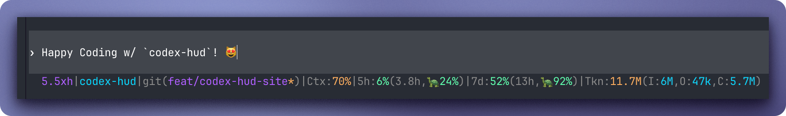

**Language** · English | [Português (Brasil)](README.pt-BR.md) | [简体中文](README.zh-CN.md) | [繁體中文](README.zh-TW.md) | [日本語](README.ja.md) | [한국어](README.ko.md) | [Türkçe](README.tr.md) | [Русский](README.ru.md) | [Tiếng Việt](README.vi.md) | [ไทย](README.th.md) | [Deutsch](README.de.md) | [Español](README.es.md)

<div align="center">

# Codex HUD

**A workspace HUD for the OpenAI Codex CLI — compact single-line footer status for patched mode, plus standalone workspace snapshots for local inspection.**

[](https://github.com/brandonwie/codex-hud/blob/main/package.json)
[](LICENSE)
[](https://github.com/brandonwie/codex-hud/stargazers)
[](https://github.com/brandonwie/codex-hud/commits/main)

[](rust/Cargo.toml)
[](https://nodejs.org)
[](https://github.com/openai/codex)
[](#configuration)
[](#quick-start)

<a href="https://brandonwie.github.io/codex-hud/">Website</a> · <a href="https://brandonwie.github.io/codex-hud/#try">Try settings</a>



[Features](#features) · [Quick Start](#quick-start) · [Configuration](#configuration) · [Patched Codex Footer](#experimental-patched-codex-footer) · [Roadmap](#roadmap)

</div>

---

Codex HUD is a local Codex plugin with two surfaces: standalone commands can print an expanded workspace snapshot for local inspection, and the experimental patched Codex TUI can render the compact `--line` output as a single-line footer.

By default it is a companion to Codex's native `[tui].status_line`, because stock Codex cannot render arbitrary plugin output under the input area — it exposes a configurable built-in status item array but not a plugin-owned renderer. This repo also ships a maintained patch path for users who want the compact status line to render directly in the real Codex footer.

The compact status line, printed by `--line` (rendered as an in-TUI footer only in patched mode):

```text
5.6-sol|h|f|codex-hud|git(main*)|Ctx:█░░░░ 21%|5h:█░░░░ 17%(5h,🐢100%)|7d:█░░░░ 16%(5.1d,👾27%)
```

> The segments, labels, colors, thresholds, and compact/full identity format in that line are configurable — see [Configuration](#configuration). Model, reasoning effort, and non-standard service tiers are separate atoms. Standard/default service is hidden; compact mode shortens visible tiers such as `fast` → `f` and `priority` → `p`.

> The `5h` and `7d` segments use the newest eligible account-wide rate-limit snapshot in Codex rollout events. Eligible snapshots belong to the `codex` limit bucket or use the legacy format without a limit ID; the newest event timestamp wins, and other named buckets are ignored. Both windows come from that one snapshot and are matched by length (300 and 10080 minutes); a missing window is omitted. Values refresh only when a matching rollout event is available.

The default status-line renderer is `codex-hud`, a small native Rust binary (edition 2021, MIT): a single self-contained executable with no interpreter on the rendering path, a minimal dependency footprint (just `serde_json` and `toml`), zero `unsafe` code, and a size-optimized release build that comes in around 574 KB. For clarity, two different "Rust"s appear in this README: the upstream Codex CLI is itself a Rust program (the build target of the experimental patch below), while `codex-hud` is the separate in-repo status-line renderer.

## Features

- Codex version, model, reasoning effort, sandbox, and approval mode
- Native Codex status-line item count and color setting
- Compact usage parsed from Codex rollout logs — the compact line above (an in-TUI footer in patched mode)
- Current working directory, git branch, dirty counts, and repo root
- Project hints such as package name, nearby `AGENTS.md`, and 3B `ACTIVE-STATUS.md` priority when present
- Codex hook event counts from `hooks.json`
- A clear note that Codex's native status line remains authoritative for live token and rate-limit values

## Quick Start

### Install

The fastest path. It builds from source, so it needs `git`, `node`, and a Rust toolchain (`cargo`) on your `PATH`, plus a working `codex`:

```bash
curl -fsSL https://raw.githubusercontent.com/brandonwie/codex-hud/main/install.sh | bash
```

Run the same command again to update an existing install. The website presents Install and Update as separate copy blocks while keeping one auditable script path.

This clones a pinned release, builds the `codex-hud` renderer, installs the stock-delegation launcher, and registers the plugin — it does **not** touch your existing `codex` command. To also make `codex` resolve to the HUD launcher, pass the flag to the shell that runs the script: `curl -fsSL https://raw.githubusercontent.com/brandonwie/codex-hud/main/install.sh | CODEX_HUD_MAKE_DEFAULT=1 bash`. To preview without changing anything, run `bash install.sh --dry-run` (or set `CODEX_HUD_DRY_RUN=1`). To audit before running, download with `curl -fsSLO https://raw.githubusercontent.com/brandonwie/codex-hud/main/install.sh`, read it, then run `bash install.sh`.

No Rust toolchain, or prefer manual control? Use the step-by-step setup below.

Clone the repo, then install it as a local Codex plugin:

```bash
git clone https://github.com/brandonwie/codex-hud.git
cd codex-hud

# Register this repo as a local plugin marketplace, then add the plugin:
codex plugin marketplace add "$(pwd)"
codex plugin add brandonwie@codex-hud
```

Start a new Codex thread after installing or reinstalling so the skill list is refreshed.

> **Tip:** `codex plugin marketplace add "$(pwd)"` reads the current directory, so run it from the repo root. You can also pass an explicit path instead of `"$(pwd)"`.

Then install the HUD launcher (recommended). The default mode **delegates to your real Codex install**, so Homebrew/npm Codex updates are picked up automatically — no rebuilds, no patched binaries. To be clear: the stock-delegation launcher does **not** render an in-TUI footer — it provides safe delegation plus the managed `codex` shim; an in-TUI footer exists only in the experimental patched mode below.

```bash
npm run install:launcher                    # installs ~/.local/bin/codex-hud-tui
npm run install:launcher -- --make-default  # optional: make `codex` resolve to the launcher
rehash
```

Build the Rust status-line renderer before using standalone `codex-hud`, `--print-config`, or the experimental patched footer. This changes nothing visible in a stock-launched TUI, but it provides the command used by `--watch` and by hand-wired `status_line_command` integrations. Once built, the installer picks it up automatically (`--renderer auto`) for patched mode and `--print-config`:

```bash
npm run build:rust   # optional: builds rust/target/release/codex-hud
```

See [HUD Launcher](#hud-launcher-stock-delegation--default) for details and `npm run doctor` for diagnostics.

## Usage

Run the Rust renderer directly during development:

```bash
npm run build:rust
./rust/target/release/codex-hud           # standalone expanded snapshot
./rust/target/release/codex-hud --line     # single compact line
./rust/target/release/codex-hud --line --color
./rust/target/release/codex-hud --json      # machine-readable
./rust/target/release/codex-hud --watch 5   # refresh every 5s
npm test
```

Terminal capture of the compact status line (`--line`):

```text
$ ./rust/target/release/codex-hud --line
5.6-sol|h|f|codex-hud|git(main)|Ctx:███░░ 50%|5h:░░░░░ 4%(4.0h,🐢21%)|7d:█░░░░ 20%(4.9d,👾30%)
```

Run `./rust/target/release/codex-hud --line --color` locally to see the same line with ANSI color styling.

`codex-hud` exposes the full flag surface after `npm run build:rust` — `--line` / `--status-line` / `--color` / `--json` / `--watch` / `--init-config` / `--print-config` / `--config-path`:

```bash
./rust/target/release/codex-hud --line --color
```

## Configuration

Both the standalone workspace snapshot and the compact status line are configurable through an optional `codex-hud.toml`. With no config file you get the defaults shown above; every key is optional and anything you omit inherits the built-in default.

The canonical schema lives in [`spec/config-schema.md`](spec/config-schema.md). This README shows the common options; use the schema when changing parser behavior or validating every supported field.

```bash
codex-hud --init-config     # scaffold ~/.codex/codex-hud.toml (--force to overwrite)
codex-hud --print-config    # print the resolved, merged config as JSON
codex-hud --config-path     # show which config files are in effect
```

### Search order

Later sources override earlier ones (per key — arrays replace, scalars override):

1. built-in defaults
2. `$CODEX_HOME/codex-hud.toml` (per-user; `$CODEX_HOME` defaults to `~/.codex`)
3. `./.codex/codex-hud.toml` (per-project; walks up to the git root)
4. `$CODEX_HUD_CONFIG` (explicit file path via env var)

A missing file is fine. A malformed or invalid file is ignored — the HUD falls back to defaults and prints a one-line note on stderr, so the status line never breaks. codex-hud keeps its own file instead of a table inside Codex's `config.toml`, so a bad HUD config can never stop Codex from launching.

### Options

```toml
# Compact by default. Set true for " | " segment spacing and ": " labels.
space = false

# Text placed between segments. The space flag controls padding around this text.
separator = "|"

# Which segments to show, in order. Ids:
#   model, project, branch, runtime, ctx, 5h, 7d, tkn
# Aliases: workspace = project + branch + runtime; context = ctx; tokens = tkn.
# (runtime / "node vX" and tkn / "Tkn:904k(...)" are off by default — add them
# to opt in.)
segments = ["model", "project", "branch", "ctx", "5h", "7d"]

# Rename a segment's label (keys are segment ids).
[labels]
ctx = "Ctx"

# Colors: a palette name, a 256-color code (0-255), or "#rrggbb" (mapped to the
# nearest 256 color). Names: dim, coral, mint, amber, cyan, violet, neonViolet.
# ok / warn / crit are the threshold colors shared by ctx / 5h / 7d.
[colors]
model = "neonViolet"
branch = "#5fafff"
ok = "mint"
warn = "amber"
crit = "coral"

# Percent thresholds (0-100) that switch ctx/5h/7d between ok/warn/crit.
[thresholds.percent]
warn = 70
crit = 90

# Formatting toggles.
[format]
percentRound = true # false -> one decimal place
bar = true          # false -> hide the ctx/5h/7d bargraph, keep the %
barWidth = 5        # bargraph width in cells (0 disables it, max 40)
barFilled = "█"     # glyph for the used part of the bargraph
barEmpty = "░"      # glyph for the remaining part of the bargraph
tokenUnits = true   # false -> raw integers (no k/M)
tokenUsage = true   # false -> total only, hide (I:.. O:.. C:..)
pace = true         # false -> hide the pace % in 5h/7d
pacePrefix = true   # false -> hide the pace icon (🐢/👾/🔥), keep the %
identityShort = true # false -> gpt-5.6-sol|high|fast instead of 5.6-sol|h|f
fastMode = false # false -> resolved tier (standard hidden); true -> force fast/f
paceSlowPrefix = "🐢"
paceNormalPrefix = "👾"
paceFastPrefix = "🔥"
```

Model, reasoning effort, and visible service tiers use the normal segment separator. Standard/default service is hidden. Compact mode maps known reasoning names such as `high` to `h` and shortens visible tiers to their first character (`fast` → `f`, `priority` → `p`); full mode keeps values such as `gpt-5.6-sol|high|fast`. A service tier that is genuinely unavailable is also omitted. Older `modelShort` and `effortShort` keys remain accepted as compatibility overrides, but new configs should use `identityShort`.

Pace markers compare usage against even burn rate: slow is more than `thresholds.pace.crit` behind pace, fast is more than `thresholds.pace.crit` ahead, and the middle band is normal. Run `codex-hud --print-config` to see the full resolved option set.

## Platform Support

The supported launcher flow targets macOS and Linux shells. WSL can work when paths resolve through the Linux filesystem, but native Windows shells are not supported because the managed launchers are Bash scripts.

| Capability | Intel macOS (`x86_64`) | Apple Silicon macOS (`arm64`) | Linux |
| ---------- | ----------------------- | ----------------------------- | ----- |
| Rust renderer and stock-delegating launcher | Supported | Supported | Supported |
| Experimental patched TUI footer | Downloads the published, checksummed `x86_64-apple-darwin` runtime for your Codex version; compiles only with `--source-build` | Downloads the published, checksummed `aarch64-apple-darwin` runtime for your Codex version; compiles only with `--source-build` | No published runtime; `--source-build` only |

No platform silently starts a long local Codex build. The **Patched Codex Runtime** workflow publishes both macOS runtimes automatically after each stable Codex release, usually within a few hours. `npm run patch:codex -- --make-default` downloads and verifies the runtime for your exact Codex version. If it is not published yet, the installer exits with the expected asset name and leaves the existing `codex` command untouched; local compilation happens only when you explicitly add `--source-build`.

## HUD Launcher (Stock Delegation — Default)

`npm run install:launcher` writes `~/.local/bin/codex-hud-tui`, a small launcher that finds your real (stock) Codex install and executes it with `exec -a codex`, so terminal integrations such as Herdr still recognize the pane as a Codex session. The stock binary's path is baked in at install time, with a runtime fallback that re-discovers Codex on `PATH` (skipping all HUD-managed entries, so the launcher can never recurse into itself).

Because the launcher delegates to stock Codex:

- Homebrew/npm Codex updates are picked up automatically — no rebuilds.
- Your Homebrew/stock Codex files are never modified or replaced.
- `npm run install:launcher -- --make-default` installs the managed `~/.local/bin/codex` shim; the installer refuses to replace a non-managed `codex` unless you pass `--force-shim`.

Remove only the managed shim with:

```bash
node scripts/install-patched-codex.js --uninstall-shim
rehash
which codex
```

### Doctor

`npm run doctor` prints the full launch-chain state — shim, launcher mode (stock/patched/legacy), stock Codex path + version, renderer state, patched payload versions, staleness, and leftover artifacts:

```text
prefix: /Users/you/.local/bin
codex shim: managed -> /Users/you/.local/bin/codex-hud-tui (/Users/you/.local/bin/codex)
launcher: v2 mode=stock (/Users/you/.local/bin/codex-hud-tui)
launcher metadata: stock_path=/opt/homebrew/bin/codex stock_realpath=/opt/homebrew/Cellar/codex/0.139.0/bin/codex stock_version=0.139.0 renderer=rust built_at=2026-06-10T12:00:00.000Z
stock codex: /opt/homebrew/bin/codex (0.139.0, realpath /opt/homebrew/Cellar/codex/0.139.0/bin/codex)
renderer: rust (/Users/you/.local/bin/codex-hud, v0.2.0; used by --print-config/patched mode only — stock launcher does not invoke it)
patched payload dir: /Users/you/.local/bin/codex-hud-codex.d
patched versions: (none)
patched command: (none)
status: healthy
```

It exits non-zero only when the active entrypoint chain is broken — renderer degradation never flips a healthy status. One config check counts as broken: a stock-mode launcher while `$CODEX_HOME/config.toml` declares `[tui].status_line_command`, because stock Codex ignores that key and the footer silently disappears (`npm run patch:codex` restores it, or remove the key). The renderer rebuild recommendation is release-granularity: it compares the compile-time `codex-hud` version against `package.json`, so it fires when a release moves the version, not on every commit.

For patched-mode maintenance, `npm run codex:check` compares the stock version, patch-set id, Code Mode helper, and deployed payload SHA-256 without changing anything. `npm run codex:sync` performs the same check and then no-ops, refreshes launcher metadata, or installs the published runtime through the staged `npm run patch:codex` path when either Codex or codex-hud's patch set changed. When that runtime is not published yet, it reports `pending`, keeps the current runtime, and exits 0. It never compiles Codex unless you pass `--source-build`.

## Troubleshooting

Start with `npm run doctor`; it prints the active shim, launcher, stock Codex, renderer, and patched payload state.

| Symptom | Doctor signal | Fix |
| ------- | ------------- | --- |
| `codex` does not start after enabling the shim | `codex shim` missing, unmanaged, or points somewhere unexpected | Run `npm run install:launcher -- --make-default`, then `rehash`. If a non-managed shim exists, inspect it before using `--force-shim`. |
| Exit 127 or "no stock codex found" | `stock codex: not found` or launcher metadata has no usable stock path | Install or repair the stock Codex CLI, then rerun `npm run install:launcher` so the launcher records the real path. |
| A Codex update starts compiling Codex | An older codex-hud installer is running Cargo instead of downloading the published runtime | Update codex-hud and rerun `npm run codex:sync`. The current installer downloads the published runtime or reports `pending`; use `--source-build` only when you intentionally want a local build. |
| Patched footer disappeared after a Codex update | `patched command` exists but doctor reports stale versions | Run `npm run codex:sync`, or switch back to stock delegation with `npm run install:launcher`. |
| `codex:sync` reports `pending` | The runtime for the new Codex version is not published yet, or your codex-hud checkout is behind the latest release | Keep working: the current patched runtime stays active. Rerun `npm run codex:sync` later, update codex-hud if it is behind, or pass `--source-build` to compile locally. |
| Config changes are ignored | `codex-hud --config-path` does not list the file you edited, or `--print-config` shows defaults | Move the config to `$CODEX_HOME/codex-hud.toml`, `./.codex/codex-hud.toml`, or set `$CODEX_HUD_CONFIG` to the exact file. |
| Rust renderer is not used | `renderer` reports a missing binary or failed health check | Run `npm run build:rust`, then reinstall the launcher or rerun the patched flow that should use the Rust renderer. |

### Migrating from an older codex-hud install

If you previously ran `npm run patch:codex` (the old default flow), run `npm run install:launcher` once: it rewrites `codex-hud-tui` to stock delegation and keeps your existing `codex` shim working. A healthy legacy `codex-hud-codex` command is left in place (with a staleness note); a broken one is quarantined as `codex-hud-codex.broken-<timestamp>` so it fails fast instead of dying mid-launch. The next `npm run patch:codex` migrates a legacy flat payload into the versioned layout automatically. `npm run doctor` shows anything left over.

## Experimental: Patched Codex Footer

> **Warning — experimental.** This mode installs a patched Codex binary. The installer downloads a checksummed, ad-hoc-signed runtime release for the detected Codex version and target, plus OpenAI's signed `codex-code-mode-host` from the same Codex release; it compiles Codex only when you pass `--source-build`. macOS may kill unsigned local builds (the installer health-checks every payload *before* activating it, so a failed build can never break your active `codex`), and the patched runtime **lags stock Codex updates** until the matching runtime is published — run `npm run codex:sync` after Codex updates. Prefer the default stock-delegating launcher unless you specifically want the in-TUI footer.

Stock Codex cannot render arbitrary plugin output under the input area. To get a Claude-HUD-style footer, build a separate patched Codex command:

```bash
npm run patch:codex:dry-run
npm run patch:codex
```

The installer looks for `codex-hud-codex-v<version>-p<patch-set-id>-<target>.tar.gz` under the `codex-runtime-v<version>` release. The patch-set id is the first 12 hex characters of the SHA-256 of `scripts/codex-patch-set.js`, so any change to the patch produces new asset names instead of replacing runtimes that older codex-hud checkouts still use. It verifies the adjacent SHA-256 file, requires a manifest containing the same patch-set id, upstream source commit, and payload SHA-256, requires the upstream `LICENSE` and `NOTICE`, and then runs the patched binary's `--version` health check. It also downloads `codex-code-mode-host-<target>.tar.gz` from the matching `openai/codex` `rust-v<version>` release and, on macOS, refuses it unless it is signed by OpenAI's Developer ID team (`2DC432GLL2`). Codex looks for that helper beside its own executable, so shipping the same-version helper keeps Code Mode working and avoids IPC mismatches with a newer stock helper. If no matching runtime is published, the installer exits with the expected asset name; it never starts a build on its own. The **Patched Codex Runtime** workflow checks every hour for a new stable Codex release and builds only the missing macOS targets (`aarch64-apple-darwin` on the Apple Silicon runner, `x86_64-apple-darwin` on the Intel runner); maintainers can also dispatch it for a specific version. GitHub pauses scheduled workflows after 60 days without repository activity, and syncs report `pending` until the workflow is re-enabled. Pass `--source-build` to compile locally instead (Intel builds use LTO disabled and 16 release codegen units). In both cases, the executable and its helper are staged under `~/.local/bin/codex-hud-codex.d/<version>/` **before** anything is activated; only then is `~/.local/bin/codex-hud-codex` atomically retargeted to the new payload, and the previous version is kept on disk for rollback. A failed payload is kept aside as `<version>.failed` and the active runtime is left untouched. The installer also writes `~/.local/bin/codex-hud-tui` in patched mode, a launcher that runs the versioned payload (so Codex finds that helper) and passes the colored status-line command through Codex's `-c tui.status_line_command=...` override without changing `~/.codex/config.toml`. With the default `--renderer auto`, the injected command is `'~/.local/bin/codex-hud' --line --color`; if that Rust renderer is missing or fails its health check, the patched install stops instead of falling back to another renderer. The executable path and `argv[0]` both keep Codex-visible names, so terminal integrations such as Herdr can still recognize the pane as a Codex session.

The source patch also keeps local plugin disablement as a kill switch for remotely installed plugins. A remote bundle loads only when both the account-side state and `plugins.<id>.enabled` permit it, so turning a plugin off in `/plugins` removes its bundled skills and tools from the next Codex session without weakening workspace or administrator disables.

Patched mode also passes live session state to the HUD renderer through four stable environment variables: `CODEX_HUD_MODEL`, `CODEX_HUD_EFFORT`, `CODEX_HUD_SERVICE_TIER`, and `CODEX_HUD_ROLLOUT_PATH`. Each patched session therefore keeps its own identity, context, and token totals. A fresh session may briefly have no effort value or rollout path; until Codex finishes opening the rollout, the HUD omits segments whose values are unavailable. Live `/model`, reasoning, and `/fast` changes are reflected immediately, but Codex's `/model` flow can persist the model and effort to global `~/.codex/config.toml`. For a session-only identity, launch with `codex -m <model> -c 'model_reasoning_effort="<effort>"'`. The `5h` and `7d` segments use the newest eligible account-wide rate-limit event: either the `codex` limit bucket or a legacy unnamed snapshot. Both windows come from that one snapshot, and a missing window is omitted; values refresh only as matching rollout events arrive. The installer and `npm run doctor` also verify that the deployed `~/.local/bin/codex-hud` actually consumes these variables: a renderer built before this contract fails the patched-mode install health check (with a `npm run build:rust` hint) instead of silently falling back to `config.toml` identity and another session's usage.

Safe launcher mode leaves your normal `codex` command alone:

```bash
codex-hud-tui
```

To make a fresh `codex` launch use the HUD-enabled TUI, opt in to the managed shim:

```bash
npm run patch:codex -- --make-default
rehash
which codex
codex
```

`which codex` should resolve to `~/.local/bin/codex`. The installer refuses to replace an existing `~/.local/bin/codex` unless you pass `--force-shim`, and it still refuses to install the patched binary itself as `codex` unless you pass `--replace-codex`.

Rollback removes only the managed `codex` shim:

```bash
node scripts/install-patched-codex.js --uninstall-shim
rehash
which codex
```

If you prefer a persistent config, add the printed line under your existing `[tui]` table, but note that stock Codex versions may reject unknown fields. Generate the exact line for your machine from the repo root (`node scripts/install-patched-codex.js --print-config` resolves the renderer the same way the installer does):

```bash
echo "status_line_command = \"$HOME/.local/bin/codex-hud --line --color\""
```

Then paste it under `[tui]` in `~/.codex/config.toml`:

```toml
# Replace /Users/you with your home directory.
status_line_command = "/Users/you/.local/bin/codex-hud --line --color"
```

Run `codex-hud-tui` to see the compact footer. The patched runtime does not change when stock Codex updates: the patched launcher prints a one-line warning at launch when stock Codex changed (it still runs the patched runtime you opted into). Run `npm run codex:sync` from the repo to update it; it no-ops when current, refreshes launcher metadata when only the stock realpath changed, installs the published runtime when the stock version, patch-set id, Code Mode helper, or deployed payload hash changed, and reports `pending` until that runtime is published. Use `npm run install:launcher` to switch back to stock delegation. Each update is staged, health-checked, and atomically activated; the previous working version stays under `~/.local/bin/codex-hud-codex.d/` for rollback, and `npm run doctor` reports staleness and broken payloads. When the managed `codex` shim is active, the installer skips that shim while detecting the base Codex version and uses the next real `codex` on `PATH`; pass `--version <version>` if you need to pin the target version explicitly.

**Build cache.** An explicit `--source-build` leaves a multi-GB Cargo `target/` tree under `~/.cache/codex-hud/openai-codex-rust-v<version>` while it runs; a prebuilt runtime download does not. After a successful source build the installer strips these build trees by default — it keeps a shallow source clone for the newest `--keep-versions` (default 2) and removes older source directories entirely. Rollback uses the installed payloads under `~/.local/bin/codex-hud-codex.d/`, not the build cache, so stripping `target/` is safe. Pass `--retain-build` (`npm run patch:codex -- --retain-build`) to keep the full trees for debugging. Reclaim space on demand with `npm run cache:clean`, or preview first with `node scripts/install-patched-codex.js --prune-cache` (dry-run by default; add `--apply` to delete). `npm run doctor` reports the build-cache size and flags it once it grows past 10 GB.

## Project Layout

```text
codex-hud/
├─ plugins/
│  └─ codex-hud/
│     ├─ .codex-plugin/plugin.json
│     └─ skills/codex-hud/SKILL.md
├─ rust/                             # codex-hud source (default status-line renderer)
└─ scripts/
   ├─ test-codex-hud.js
   ├─ test-codex-hud-config.js
   ├─ test-patched-codex-installer.js
   ├─ test-rust-golden.js
   ├─ test-rust-parsing-golden.js
   ├─ test-rust-cli.js
   └─ install-patched-codex.js
```

## Roadmap

- Add richer session transcript summaries if Codex exposes a stable local session-state API for plugins.
- Keep `codex-hud` covered by the golden fixtures (`npm run test:rust` verifies the Rust renderer against them).
- Watch upstream OpenAI Codex issue [#17827](https://github.com/openai/codex/issues/17827). As of 2026-06-10, stock Codex still has built-in `[tui].status_line` items but no command-backed or plugin-owned renderer; retire the patch only when a supported custom renderer ships.
- Ship prebuilt `codex-hud` release binaries with SHA-256 checksums so the one-line installer can skip the local Rust build.

## Contributing

Issues and pull requests are welcome. See [CONTRIBUTING.md](CONTRIBUTING.md) for the contribution workflow and the full maintainer-scripts reference.

## License

[MIT](LICENSE) © Brandon Wie

Website UI direction openly inspired by [Herdr](https://herdr.dev/). I'm a huge fan.

## Star History

[](https://star-history.com/#brandonwie/codex-hud&Date)
